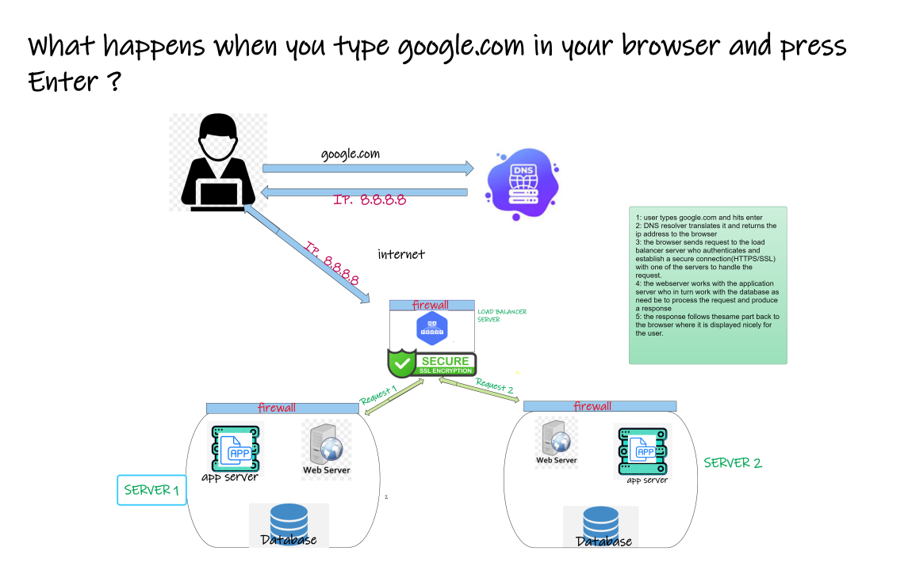
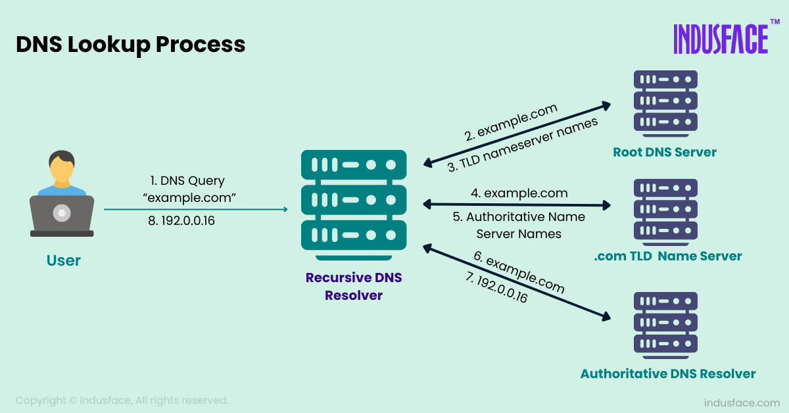

# What Happens When You Type [google.com](https://www.google.com) And Press Enter.

When you type **google.com** and press enter a series of evnts happen involves a complex series of events happen in just a few seconds that leads to the display of the google home page including looking up the website's IP address, establishing a secure connection, and sending a request to google's servers. The browser then receives the google homepage content and displays it in the browser window.The series of events are;

1. DNS request.
2. TCP/IP connection.
3. Firewall
4. HTTP request.
5. Load balance.
6. Web server response.
7. User Interaction.

Here are the series of events broken down;

## 1. DNS request.

When you type Google.com or any domain name in your browser on your computer or device what really happens is, a request is sent to the domain name system (DNS) server which serves as an address book for all domain names. This then sends back the exact IP address of the server which https://www.google.com points to. This address will be like 123.16... remembering these numbers for humans is not possible, hence the best way is using Domain name system servers. The domain names are a way for humans to remember easily forexample Google.com,Instagram.com, Twitter.com among others.

A server is a computer program or device that provides a service to another computer program and its user, also known as the client. In this case, you are the client and you would like to access google.com.

If you had accessed google.com earlier, the browser first checks its cache to see if it has a recent record of that domain name.If there is a recent copy of the DNS records for that domain, it will use the IP address in the cache to send a request to the server. This speeds up the process of resolving the domain name to an IP address because it avoids the need to send a request to the DNS server to resolve the domain name to an IP address, a process called DNS lookup.

## 2. TCP/IP connection.

Transmission Control Protocol/Internet Protocol establishes a connection with google’s server or domain name server you are looking for. Once your computer has the IP address for google.com, TCP ensures that the data sent between the computer and google’s server is delivered correctly, while IP is a protocol that ensures that the data is sent to the correct destination. This is like communication between the browser and server with the google domain name and when the server receives the request it sends back a message acknowledging the request to establish a connection.

The server finally sends back google.com with HTML code to the browser using TCP. The browser receives the HTML code and uses it to render the webpage on the screen.

## 3. Firewall

Once a request is received from the computer, the remote server try to verify the authentication of the computer’s identity through firewalls.

A firewall monitors network traffic and ensures that only authorized traffic is allowed in and out of the network. It uses a set of rules to determine which traffic is allowed and which is blocked

A firewall keeps a network safe and secure by preventing unauthorized access and protecting against cyber threats.

## 4. HTTP request.

Once the TCP/IP connection is established, the browser and google’s server then begin to establish a secure connection using HTTPS **(Hypertext Transfer Protocol Secure)**, this is a secure version of the HTTP protocol used to transmit data on the internet. It is used to encrypt the data. Data is transmitted between your browser and Google’s server

## 5. Load balance.

A load-balancer is a device that distributes incoming network traffic across multiple servers. In the case of a browser trying to access google.com, the load balancer would receive the incoming request from the browser and then forward it to one of the servers in the google server network. This will also work the same way for any domain name you are trying to search for. Its main purpose is to ensure no single server gets overwhelmed hence improving:

- Performance

- Reliability

- Scalability

- Availability

## 6. Web server response.

Web server is a software program that is responsible for delivering web content to clients, typically web browsers, in response to their requests.Once the request is received by one of google’s servers from the load balancer, it is passed to a web server. The web server is responsible for processing the request, generating the HTML, CSS, and JavaScript that make up the webpage, and sending it back to the browser for you to see it.

## 7. User Interaction.

Now the page is interactive, and you can use the search box to do what you want.
